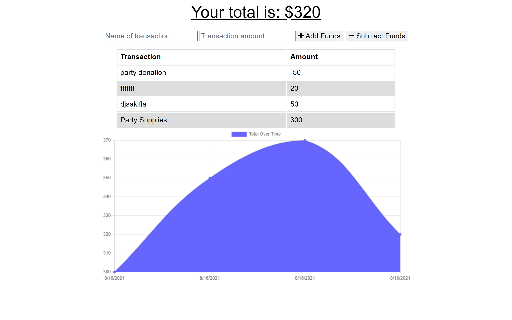

# Progressive Budget
[](https://opensource.org/licenses/MIT) &nbsp;&nbsp;&nbsp;&nbsp; &nbsp;&nbsp;&nbsp;&nbsp; &nbsp;&nbsp;&nbsp;&nbsp;


## :memo: Description
  Budget Tracker application that allows users to add expenses and deposits to their budget with or without a connection. When entering transactions offline, these will be added to their transaction history when their connection is back online.


## :trophy: Table of Contents
* [Installation](#installation)
* [Usage](#usage)
* [License](#license)
* [Contributing](#contributing)
  
  

## Installation
To run locally:
* Fork the https://github.com/Karina5151/Progressive-Budget repo.
* Clone your forked repo to VS Code on your computer.
* Open entire parent folder of the project in your terminal.
* Install the node dependencies by entering in the terminal:
```
npm i
```

User must then run `node server.js` in the terminal. The application will then be listening on port 8080. Open your browser and put `localhost:3000` in the address bar of the browser page to see the application on your local device.

  
## Usage
Giving users a fast and easy way to track their money by allowing them to access that information anytime, whether the application is online or offline.

Launch Heroku deployed web application [here](https://infinite-cliffs-60426.herokuapp.com/)



## License

This project is governed by the license: MIT

  
## Contributing
This application was developed by Karina Clausen.

The technologies that made this possible are:
* HTML
* CSS
* <a href="https://www.javascript.com/" target="_blank">JavaScript</a>
* <a href="https://nodejs.org/api/fs.html" target="_blank">Node.js</a>
* <a href="https://expressjs.com/" target="_blank">Express.js</a>
* <a href="https://www.json.org/json-en.html" target="_blank">JSON</a>
* <a href="https://getbootstrap.com/" target="_blank">Bootstrap</a>
* <a href="https://mongoosejs.com/" target="_blank">Mongoose</a>
  
 ---

## :question: Questions

For any questions, please contact me using the information below:

:octocat: GitHub: [@Karina5151](https://github.com/Karina5151)

:envelope: Email: karina.clausen.11@gmail.com